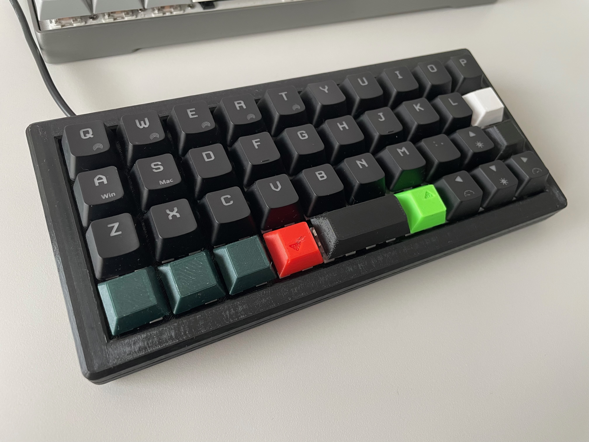

# 3D printed 40 percent ortholinear raspberry pi pico based mechanical keyboard

## You will need

- 3D printer
- Raspberry Pi Pico
- 47 Cherry MX compatible switches
- Optional - 1 Cherry MX compatible stabilizer (as the spacebar is only 2U size, it is not neccesary to have a stabilizer there)
- 47 keycaps (can be also printed if you want to)
- 47 1N4148 diodes
- some wire
- soldering iron
- a lot of patience

*Tip: if you are cheap like me, you can harvest most of the parts from a cheap second hand mechanical keyboard*

## Build

1. Print the base plate from `parts/base_plate`

2. Assemble all the switches and stabilizer to the base plate

*I had to modify the base plate with a knife and hot glue the stabilizers, I pushed an updated version of the model to this repo, so hopefully you will have an easier time assembling it.
I did not use the stabilizers in the end, as the 2U spacebar works just fine without them.*

3. Solder diodes to the switches and connect them in a row as shown in picture below

4. Solder wires to the rows of diodes and route them to one place

5. Solder wires to the switches in columns as shown in picture below

6. Choose your GPIO pins on the pico based on your firmware in `pins.py` and solder the wires to the pico

7. Print the case from `parts/case` and carefully put the keyboard and pico inside

- I wrapped the pico in electrical tape to prevent short circuits inside the keyboard.

*Currently in its second generation, the case still does not fit correctly, I modified the second prototype with
side cutters and the case works with zip ties. If I get around to another model and print, I will update this repo.*

## Flashing the firmware

1. Install circutpython on your pico
2. Copy the `adafruit_hid` folder to the `lib` folder on pico.
3. Modify your keymaps in `keymaps.py`
4. Copy the `keymaps.py`, `pins.py` and `code.py` files to the pico.
5. When you are done testing your firmware, you can copy the file called `boot.py` to your pico to prevent it appearing as
a usb drive on your pc.

## Sources

- Firmware is based on this tutorial: https://learn.adafruit.com/diy-pico-mechanical-keyboard-with-fritzing-circuitpython/code-the-pico-keyboard
- In a revision I ended up using this model for the keyboard body: https://www.printables.com/model/345568-fortyorty
